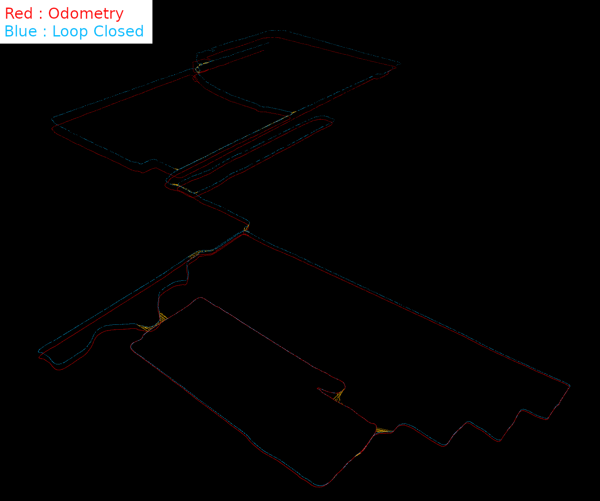

# SimpleLoopClosure
## Overview
This repository is a ROS implementation of Loop Closure for LiDAR SLAM.  
It is a simple implementation using pose graph optimization with GTSAM and radius search with nanoflann.  
It was created to obtain Loop Closed point cloud maps from an algorithm that provides only LiDAR odometry.  

## Tested LiDAR Odometry Algorithms
- [KISS-ICP](https://github.com/PRBonn/kiss-icp)
- [Point-LIO](https://github.com/hku-mars/Point-LIO)
- [Direct LiDAR-Inertial Odometry](https://github.com/vectr-ucla/direct_lidar_inertial_odometry)

## Demo

  
  

## ROS2
[ashBabu](https://github.com/ashBabu) has created a ROS2 implementation based on this repository.  
Excellent work. Thank you!  
[https://github.com/ashBabu/simple_loop_closure/tree/ros2](https://github.com/ashBabu/simple_loop_closure/tree/ros2)

## Build
Please install [GTSAM4.x](https://gtsam.org/get_started/).
~~~
  cd catkin_ws
  git clone --recursive https://github.com/kamibukuro5656/SimpleLoopClosure.git src
  catkin_make -DCMAKE_BUILD_TYPE=Release
~~~

## Execution
Example: Point-LIO
~~~
roscore
rosparam set use_sim_time true
[launch Point-LIO]
roslaunch simple_loop_closure run_point_lio.launch
rosbag play --clock [bag file]
~~~
## Saving Point Cloud Maps
Please put the destination directory in the "save_req" topic and publish.
~~~
rostopic pub /save_req std_msgs/String "data: '[directory]'"
~~~

## Parameters
Please refer to [Parameters.md](Parameters.md).

## Requirements for LiDAR Odometry
- LiDAR odometry must publish "nav_msgs::Odometry" format odometry and a paired LiDAR scan.
- The timestamps of the two topics must be almost the same time.

## Acknowledgments
I would like to thank the creators of the following open source packages:
- [GTSAM](https://github.com/borglab/gtsam)
- [nanoflann](https://github.com/jlblancoc/nanoflann)
- [LeGO-LOAM](https://github.com/RobustFieldAutonomyLab/LeGO-LOAM)
